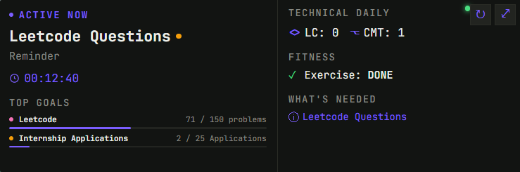
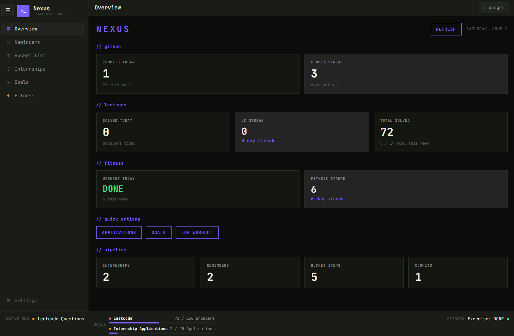
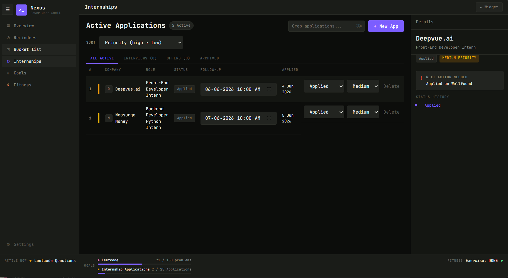

# Acestar Nexus

A personal desktop companion widget built for daily use. Sits on your desktop like a Rainmeter skin — always visible, always current. Click to expand into a full dashboard.

> Built for a developer who forgets things, loses focus after gaming sessions, and needs a persistent cue to stay on track.

---

## Why I Built This

[Nexus](https://github.com/Acestar21/nexus) gave me developer metrics but I still forgot reminders, internship follow-ups, and personal goals. I wanted something that stayed visible on the desktop and surfaced one priority at a time — not another dashboard I had to remember to open.

Acestar Nexus is my personal adaptation of Nexus focused on daily execution rather than developer analytics.

## What I Learned

- Packaging Python sidecars with PyInstaller and wiring them into a Tauri desktop app
- Managing local-first data with SQLite + SQLModel across dev and production environments
- Building MCP servers as modular, swappable data providers
- Cross-platform desktop integration — OS notifications, window management, startup behavior
- Designing a persistent UI that's useful without being distracting


## What it does

**Widget (compact, always-on-top):**
- Shows the single most urgent item right now — a firing reminder, a follow-up due, a goal falling behind
- Live snapshot: LeetCode progress, GitHub commits, exercise status, pending reminders and todos
- Refreshes every 5 minutes, manual refresh available

**Dashboard (click to expand):**
- **Overview** — metric cards for GitHub, LeetCode, fitness, and pipeline counts at a glance
- **Reminders** — with priority levels (High/Medium/Low), alarm times, and OS notifications
- **Bucket List** — longer-term todos without strict deadlines
- **Internships** — track applications with status flow, detail panel, and next-action callouts
- **Goals** — progress tracking with weekly pace calculation and behind/on-track indicators
- **Fitness** — daily workout logging with streak tracking

---

## Stack

| Layer | Tech |
|-------|------|
| Shell | Rust + Tauri |
| Backend | Python + FastAPI + SQLModel |
| Database | SQLite (persists to `~/.acestar_nexus/`) |
| Frontend | React + TypeScript |
| Data Sources | MCP servers — LeetCode, GitHub, Fitness |
| Notifications | Tauri notification plugin |

The Python backend runs as a sidecar process spawned by Tauri. MCP servers handle external API calls via stdio transport. All data is local — no cloud, no accounts.

---

## Architecture

```
acestar_nexus/
├── backend/          # FastAPI app — CRUD routers, focus engine, metrics aggregator
├── frontend/         # React/TS — widget, dashboard, snapshot context
├── mcp-servers/      # Standalone MCP servers for LeetCode, GitHub, fitness
└── src-tauri/        # Rust shell — window management, sidecar spawn, notifications
```

---

## Screenshots

### Widget 


### Dashboard


### Goals


### Internship


---

## Dev Setup

**Prerequisites:** Rust, Node.js 18+, Python 3.12+, MSVC Build Tools (Windows) or gcc (Linux)

```bash
git clone https://github.com/Acestar21/acestar_nexus.git
cd acestar_nexus

# Python dependencies
python -m venv venv
source venv/bin/activate  # Windows: venv\Scripts\activate
pip install -r requirements.txt

# Frontend dependencies
cd frontend && npm install && cd ..

# Copy env
cp .env.example .env
# Fill in LEETCODE_USERNAME, GITHUB_USERNAME, GITHUB_TOKEN
```

**Run in dev mode:**
```bash
# Windows
start.bat

# Linux
./start.sh
```

---

## Building from Source

### 1. Build Python sidecars

```bash
pip install pyinstaller

# Backend
cd backend
pyinstaller --onefile --console --name acestar-backend main.py

# MCP providers
cd ../mcp-servers/github
pyinstaller --onefile --noconsole --name github-provider server.py

cd ../leetcode
pyinstaller --onefile --noconsole --name leetcode-provider server.py

cd ../fitness
pyinstaller --onefile --noconsole --name fitness-provider server.py
```

### 2. Copy to src-tauri/bin/ with platform triple

**Windows:**
```
acestar-backend-x86_64-pc-windows-msvc.exe
github-provider-x86_64-pc-windows-msvc.exe
leetcode-provider-x86_64-pc-windows-msvc.exe
fitness-provider-x86_64-pc-windows-msvc.exe
```

**Linux:**
```
acestar-backend-x86_64-unknown-linux-gnu
github-provider-x86_64-unknown-linux-gnu
leetcode-provider-x86_64-unknown-linux-gnu
fitness-provider-x86_64-unknown-linux-gnu
```

### 3. Build

```bash
cargo tauri build
```

Installer outputs to `src-tauri/target/release/bundle/`.

---

## Environment Variables

```env
LEETCODE_USERNAME=your_username
GITHUB_USERNAME=your_username
GITHUB_TOKEN=your_personal_access_token
```

GitHub token needs `read:user` scope for contribution data.

---

## Data

All user data lives in `~/.acestar_nexus/`:
- `nexus.db` — SQLite database (reminders, goals, internships, todos)
- `fitness.json` — workout log

No data leaves your machine.

---

## Related

- [Nexus](https://github.com/Acestar21/nexus) — the open-source developer intelligence dashboard this project branches from

---

## License

MIT
